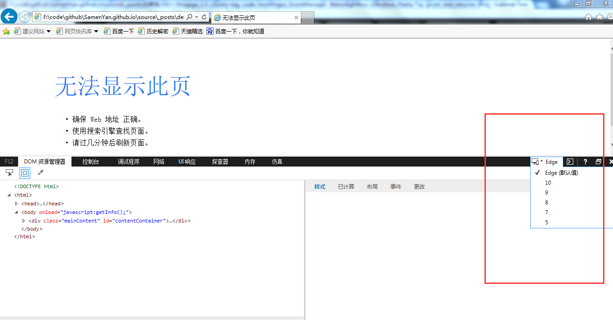

title: IE兼容我呵呵(持续更新中..)
date: 2016-08-06
tags:
	- html
	- css
	- ie 
---

>目前现任公司所有项目开发要求兼容到IE8。有一次我问经理为什么还要兼容到IE8，经理的回答我服了，“我们的项目是很国际化的，要考虑到非洲友人的硬件条件”。我想了想也是日了狗了，既然用的到互联网，尼玛还装不起高版本的浏览器。我看你们就继续扯犊子，继续惯着IE吧！废话不多说了，谈谈项目中遇到的IE兼容问题。

#### 1. CSS伪类(如:after)支持到IE8+(包含IE8);媒体查询@media、圆角border-radius、阴影box-shadow 只支持到IE9+;


#### 2. CSS3的opacity(透明度)只支持到IE9+;IE8 以及更早的版本支持替代的 filter 属性。例如：filter:Alpha(opacity=50)

#### 3. 插入背景图片时使用filter兼容IE9+；其实为了触发background-size属性，因为IE9以下无法兼容background-size。正如以下demo所示

```bash
filter: progid:DXImageTransform.Microsoft.AlphaImageLoader(src='图片地址',sizingMethod='scale');
```

```bash
<!DOCTYPE html>
<html>
<head>
<meta charset="UTF-8">
<title>让IE兼容background-size的方法</title>
<style>
.bgpic {
    background-image: url('http://img0.bdstatic.com/img/image/6992fdda3cc7cd98d10273a6b34233fb80e7aec90cc.jpg');
    background-size: cover;
    filter: progid:DXImageTransform.Microsoft.AlphaImageLoader(
    src='http://img0.bdstatic.com/img/image/6992fdda3cc7cd98d10273a6b34233fb80e7aec90cc.jpg',
    sizingMethod='scale');
}
</style>
</head>
<body>
    <div  class="bgpic" style="width:200px;height:100px;"></div>
</body>
</html> 
```

#### 4. 按F12打开IE11浏览器调试时，记得看下渲染模式版本。有些情况下，坑爹IE会默认IE8-渲染模式，让你误认为是自己的代码bug【自己纠结到蛋疼】。更坑爹是QA、PM也以为是你的代码bug【一阵逼逼即将到来】。如下图所示：


#### 5.IE8获取属性值严格遵守大小写；例如：

```bash
<p id="target" value="1"></p>
var tg = document.getElementById("target").getAttribute("value"); // "1"
var tg = document.getElementById("target").getAttribute("Value"); //undefined
```

